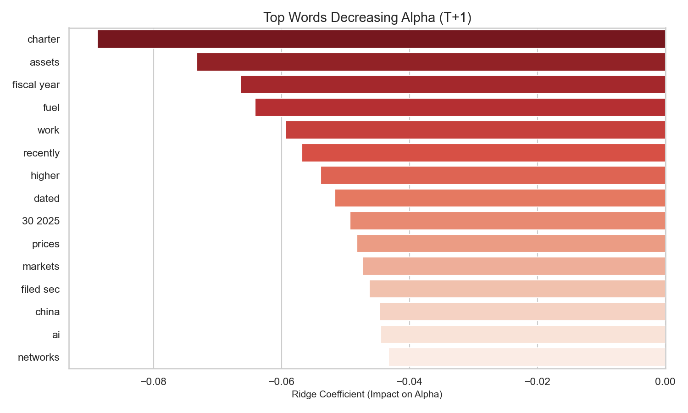
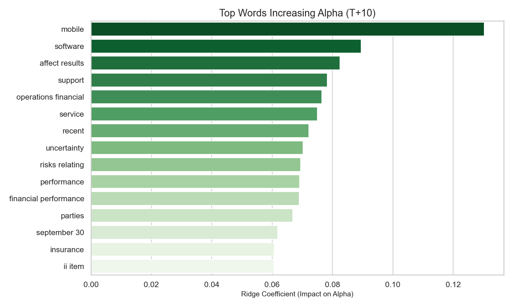

# 風險因素文本對股價回報之影響分析（經市場調整）

## 1. 前言與研究目的

本研究旨在探討向美國證券交易委員會 (SEC) 提交的 10-Q 季度報告中，「Item 1A. 風險因素 (Risk Factors)」章節的文本內容，與企業隨後「純粹」股價表現（Alpha）之間的相關性。

與分析原始回報 (Raw Returns) 的傳統方法不同，本研究具有以下特點：
1.  **訊號分離 (Alpha)**：我們扣除了市場表現（標準普爾 500 指數 / SPY），僅保留特定於該企業的股價變動。
2.  **多時間跨度分析**：我們區分了市場的即時反應 (T+1) 與短期趨勢 (T+10)。

## 2. 穩健研究方法 (Robust Methodology)

### 2.1 數據處理與 Alpha 計算
*   **語料庫**：共蒐集 5,223 份 10-Q 報告（最終有效樣本為 4,512 份）。
*   **市場調整**：對於每個日期 $t$，我們計算超額回報 (Excess Return)：
    $$ \alpha_{t+k} = R_{Stock, t \to t+k} - R_{SPY, t \to t+k} $$
    此步驟消除了宏觀經濟波動的雜訊（例如：導致整體市場上漲的降息政策）。

### 2.2 多時間跨度建模
我們針對三個不同的時間跨度訓練了模型（Ridge 嶺回歸與隨機森林）：
*   **T+1**：即時情緒反應（公告發布隔日）。
*   **T+5**：資訊消化階段。
*   **T+10**：趨勢與基本面整合。

文本在經過清理後，透過 **TF-IDF** 技術（3000 個向量）進行向量化處理。

---

## 3. 實證結果

### 3.1 時間跨度 T+1：即時反應

在極短期內，市場主要對顯示「科技成長機會」或「具體營運成本」的關鍵字做出反應。

*圖 1：在 T+1 產生最高正向 Alpha 的詞彙。*

*   **觀察**：**"mobile" (行動裝置)** 和 **"software" (軟體)** 佔據主導地位，證實了市場對科技題材的偏好。**"service" (服務)** 一詞也獲得正面評價，可能暗示著企業向經常性收入模式的轉型。

*圖 2：在 T+1 產生最高負向 Alpha（表現不佳）的詞彙。*

*   **觀察**：**"fuel" (燃料)** 是主要的風險因素（直接成本）。**"Assets" (資產)** 和 **"fiscal year" (會計年度)** 常出現在資產減值或負面會計修正的情境中。**"Charter" (特許狀/章程)** 出現極其負面的影響（可能與特定運營商或法規風險有關）。

### 3.2 時間跨度 T+10：基本面趨勢

在兩週的時間跨度內，具影響力的詞彙列表略有變化，顯示風險已進行更深層的基本面整合。

*圖 3：在 T+10 支持上漲趨勢的詞彙。*

*   **穩定性**：科技主題 (**"mobile"**, **"software"**) 仍是持續跑贏大盤的驅動力。
*   **信心**：諸如 **"support" (支持)** 和 **"operations" (營運)** 等詞彙的重要性提升，顯示營運的穩健性能在長時間內安撫投資人。

*圖 4：在 T+10 對股價造成壓力的詞彙。*

*   **結構性問題**：**"issues" (問題/議題)** 一詞成為中期強烈的負面預測指標。
*   **治理/策略**：在負面風險中出現 **"executive" (高階主管)** 和 **"dated" (過時/陳舊)** 至關重要。這暗示一旦公告被消化，與管理層動盪或產品過時相關的風險將受到市場的嚴厲懲罰。

---

## 4. 結論

透過使用市場調整後的回報 (Alpha)，我們淨化了分析結果並證明：
1.  與 **成本 (fuel)** 和 **會計 (assets)** 相關的風險會受到市場的即時懲罰。
2.  與 **公司治理 (executive)** 和 **過時技術 (dated)** 相關的風險會拖累中期趨勢。
3.  **數位轉型 (mobile, software)** 的敘事詞彙仍然是最佳的「避險」工具，系統性地與股價優於大盤的表現相關聯。
