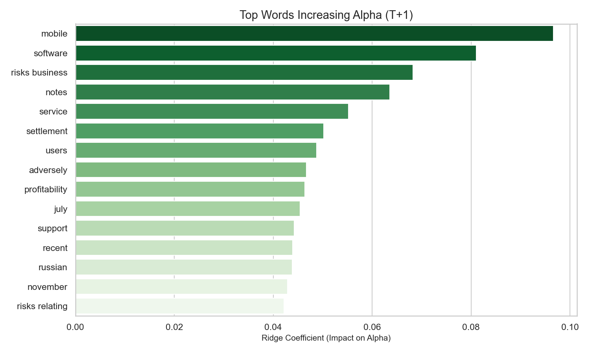
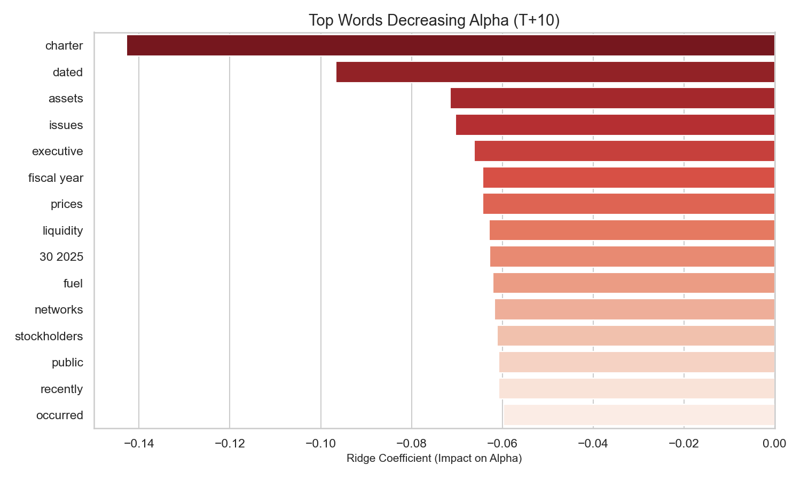

# Analyse de l'Impact Textuel des Facteurs de Risques sur les Rendements Boursiers (Ajustés du Marché)

## 1. Introduction et Objectif de Recherche

L'objectif de cette étude est d'identifier la corrélation entre le contenu textuel de la section *"Item 1A. Risk Factors"* des rapports trimestriels (10-Q) et la performance boursière "pure" des entreprises (Alpha).

Contrairement aux approches classiques qui analysent les rendements bruts, cette étude se distingue par :
1.  **L'isolation du signal (Alpha)** : Nous soustrayons la performance du marché (S&P 500 / SPY) pour ne garder que la variation spécifique à l'entreprise.
2.  **L'analyse multi-horizon** : Nous distinguons la réaction immédiate (T+1) de la tendance à court terme (T+10).

## 2. Méthodologie "Robuste"

### 2.1 Traitement des Données et Calcul de l'Alpha
*   **Corpus** : 5 223 rapports 10-Q (filtre final: 4 512 documents valides).
*   **Ajustement Marché** : Pour chaque date $t$, nous calculons le rendement excédentaire :
    $$ \alpha_{t+k} = R_{Action, t \to t+k} - R_{SPY, t \to t+k} $$
    Cela permet d'éliminer le bruit macro-économique (ex: une baisse générale des taux qui ferait monter tout le marché).

### 2.2 Modélisation Multi-Horizons
Nous avons entraîné des modèles (Régression Ridge et Random Forest) sur trois horizons temporels distincts :
*   **T+1** : Réaction émotionnelle immédiate (lendemain de l'annonce).
*   **T+5** : Phase de digestion de l'information.
*   **T+10** : Tendance et intégration fondamentale.

Le texte a été vectorisé via **TF-IDF** (3000 vecteurs) après nettoyage.

---

## 3. Résultats Empiriques

### 3.1 Horizon T+1 : La Réaction Immédiate

À très court terme, le marché réagit aux mots-clés signalant soit une opportunité de croissance technologique, soit des coûts opérationnels tangibles.

*Figure 1 : Termes générant le plus d'Alpha Positif à J+1.*

*   **Observations** : Les mots **"mobile"** et **"software"** dominent, confirmant l'appétit du marché pour la tech. Le terme **"service"** est également perçu positivement, signalant probablement la transition vers des modèles de revenus récurrents.

*Figure 2 : Termes générant le plus d'Alpha Négatif (Sous-performance) à J+1.*

*   **Observations** : Le mot **"fuel"** est un facteur de risque majeur (coûts directs). **"Assets"** et **"fiscal year"** apparaissent souvent dans des contextes de dépréciations ou de révisions comptables négatives. Le terme **"charter"** apparaît très négativement (potentiellement lié à des risques spécifiques d'opérateurs ou de régulation).

### 3.2 Horizon T+10 : La Tendance de Fond

Sur deux semaines, la liste des mots influents change légèrement, indiquant une intégration plus fondamentale des risques.

*Figure 3 : Termes soutenant la tendance haussière à J+10.*

*   **Stabilité** : Les thèmes tech (**"mobile"**, **"software"**) restent des moteurs de surperformance durables.
*   **Confiance** : Des termes comme **"support"** et **"operations"** prennent de l'importance, suggérant que la solidité opérationnelle rassure sur la durée.

*Figure 4 : Termes pesant sur le cours à J+10.*

*   **Problèmes Structurels** : Le mot **"issues"** devient un prédicteur négatif fort à moyen terme.
*   **Gouvernance/Stratégie** : L'apparition de **"executive"** et **"dated"** dans les risques négatifs est critique. Elle suggère que les risques liés au management ou à l'obsolescence ("dated") sont lourdement sanctionnés par le marché une fois l'annonce digérée.

---

## 4. Conclusion

L'utilisation de rendements ajustés du marché (Alpha) a permis de purifier l'analyse. Nous démontrons que :
1.  Les risques liés aux **coûts (fuel)** et à la **comptabilité (assets)** sont sanctionnés immédiatement.
2.  Les risques liés à la **gouvernance (executive)** et à **l'obsolescence (dated)** pèsent sur la tendance à moyen terme.
3.  Le vocabulaire de la **transformation numérique (mobile, software)** reste le meilleur "hedge" narratif, associé systématiquement à une surperformance.
